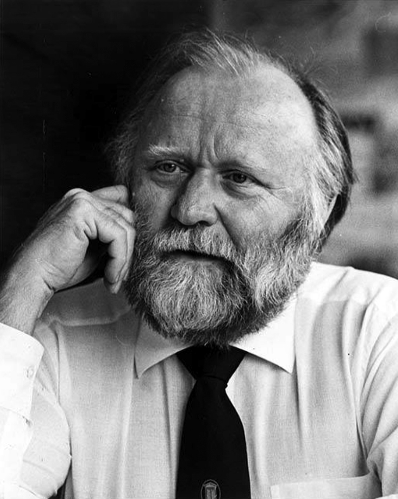

# Class Schedule

### STAT 184: Introduction to R Programmaing

This is my first time teaching STAT 184. I am passionate about R and the R community so I am very excited to be teach you all this semester! Have been coding in R for about 5 years and I use it nearly every day for both my classes and my research. I have written a few packages and even a web app all in R! There are lots of different approaches to R programming, but but we will be learning mostly from the `tidyverse` packages because I believe this to be a more unified and intuitive approach to the language (<https://www.tidyverse.org/>).  

<!-- This is how we comment in R markdown  -->
<!-- Write out the text you want to comment out, highlight it, then press Cmnd+Shift+C on a Mac and Ctrl+Shift+C on a Windows-->

<!-- Note that the default working directory for an RMarkdown documents is the directory where the .Rmd file is stored. Thus we can reference things inside this directory without specifying the entire (absolute) file path. This type of local reference is called a relative path. (If you specify the absolute file path the Rmd will render on your computer but will not render on the graders computer.) -->

<!-- Example:  -->
<!-- Absolute path: ~/Dropbox/Olivia/Conflict/school/STAT184/GitHubClassroomTemplates/184-activity-markdown-schedule/tidyverse.png -->
<!-- Relative path: tidyverse.png -->

### SODA 502: Social Data Anlaytics Approaches and Issues

I am a duel PhD student in Statistics and Social Data Analytics. Penn State has a Social Data Analytics (SoDa) program in the College of Liberal Arts and offers duel degrees to PhD students in certain departments (<https://soda.la.psu.edu/programs/graduate-program/>). After I graduate I want to work in public policy analytics in government or a think tank, so SoDA is a perfect program for me. This class is a seminar where we meet once a week for 3 hours. In the first half of the class we listen to a speaker from the SoDA program talk about their research. In the second half of the class we learn how to implement statistical methods in social data research. 

# Hobbies, Jobs, etc

### Research 

My primary research interest is empirical likelihood with network data. Empirical likelihood is essentially (but not exactly) a fancy word for histogram. This is a non-parametric (model-free) method. My current project uses Jackknife and Bootstrap methods to identify influential actors in a network. One example I am using is the Trump World data set from [Buzzfeed](https://www.buzzfeednews.com/article/johntemplon/help-us-map-trumpworld). This data set displays how all of Trumps associates are associated with each other. I hope to submit this research for publication at the end of this academic year when I take my Comprehensive Exam. 

### Sci-fi / Fantasy Books

In my free time, I love to read science fiction and fantasy novels. I have always loved science fiction and I have just recently started reading fantasy novels during the pandemic. My all time favorite series is Dune. The first 6 Dune novels were written by Frank Herbert, and the remaining 18 novels were written by his son, Brian Herbert, and Kevin J. Anderson. I am currently reading book 17 of 24 titled *Sisterhood of Dune*. I am also reading book 2 of the Stormlight Archive by Brandon Sanderson. I think that Brandon Sanderson is one of the most prominent authors who is pushing the fantasy genre into the 21st century. [Click here](https://www.brandonsanderson.com) to learn more about Brandon Sanderson. 

<!-- Example:  -->
<!-- Absolute path: ~/Dropbox/Olivia/Conflict/school/STAT184/GitHubClassroomTemplates/184-activity-markdown-schedule/example-pictures-path/frank-herbert.jpg -->
<!-- Relative path: example-pictures-path/frank-herbert.jpg  -->

 <!-- Here I have stored tidyverse.png and frank-herbert.jpg in 2 separate folders to demonstrate the difference between absolute and relative paths. In practice, it is best to store all of your pictures in one folder. If this were a repo I was using for my own homework or research, I would store both of these pictures in the same folder.  -->
